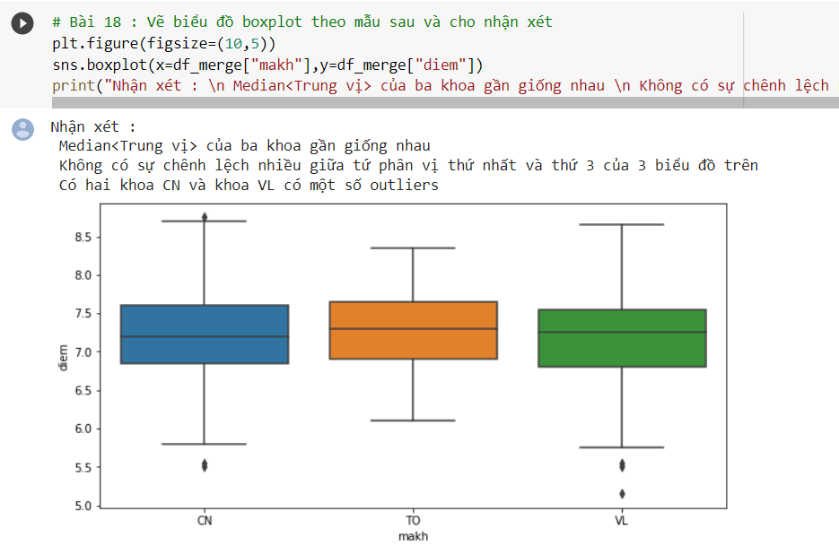
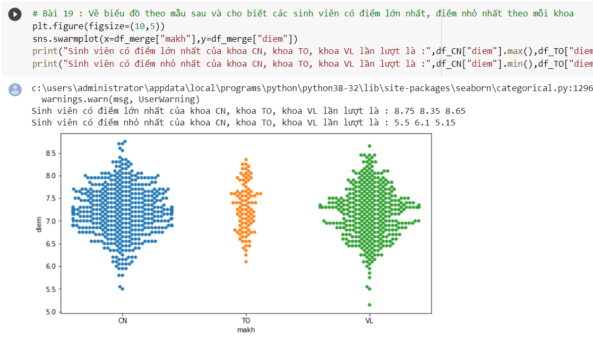
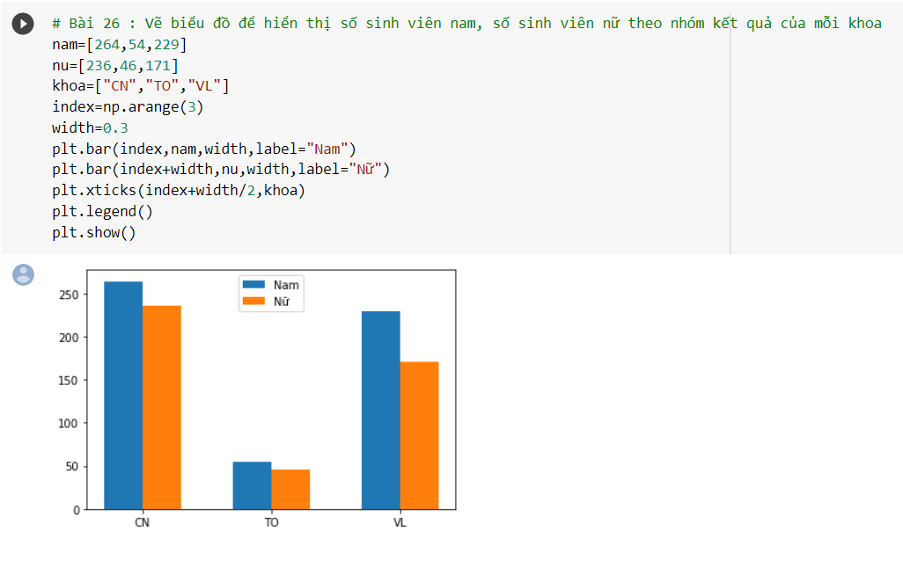

# PYTHON FOR MACHINE LEARNING, DATA SCIENCE AND VISUALIZATION
This is the final exam of the subject "PYTHON FOR MACHINE LEARNING, DATA SCIENCE AND VISUALIZATION" at the computer center of university of natural sciences.
## Explain the exame:
- language: Python.
- Tool: Jupyter Notebook
## Describe:

